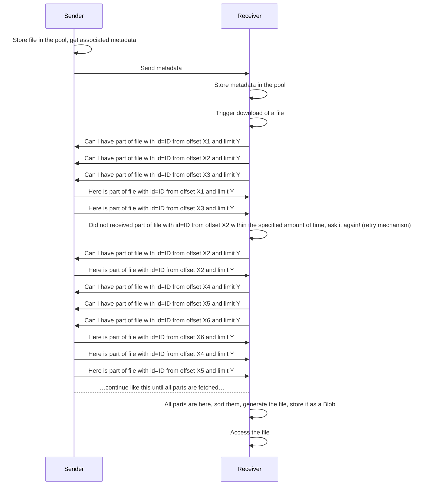

# File transfer library

This library is helpful if you want to send huge files to other users.

Technical documentation can be found here: https://lib-filetransfer.ludovicm67.fr/

## Features

Here are some of the supported features:

- this library is written using TypeScript:
  - nice autocompletion
  - checking of types
- split files into smaller parts that can be sent using the way you want
- integrated retry mechanism
- client can ask for a specific offset and limit

## Understanding the logic of this library

Imagine you have two users: a sender and a receiver.
The sender want to send a file to the receiver.
Both of them will start by creating a file pool.
The sender will store the file into his pool, and will get some metadata that will include a unique ID for this file.
He will send the metadata to the other user using a communication channel of his choice.
The receiver will store the received metadata into his pool, so that it is aware of the existence of the file.
The receiver can display a message to the user asking if he wants to download the file or not.
If he wants to download the file, a call should be performed to the pool to trigger the download.
The library is not taking care about transmitting data to the other user, you will to take care about it yourself.
You can use a WebRTC DataChannel or a WebSocket for example.
That's why the library is asking for a callback function when you call the `downloadFile` method on the pool.
You will need to send and receive data between both users, so that you can transmit requests and responses from both of them.
If a part of the file was not received within a specified amount of time, it will retry a few time.
If it is still failing after a specified amount of retries, it will throw an error.
Once all the parts of the file are received by the receiver, the library will sort all parts, generate the file and store it as a Blob object.
Starting now, you will be able to access the file, and open it in a new browser tab for the receiver user for example.
You can also send a custom message to the sender saying that the file was fully received, … the only limit is now your imagination!

Here is an illustrated flow between our two users:



To summarize, you will need to take care of having a communication channel between users, and the library is doing the rest.

## Integration

Add this library to your NodeJS project's dependencies:

```sh
npm i @ludovicm67/lib-filetransfer
```

And in your project, instantiate a pool like this:

```ts
import { TransferFilePool } from "@ludovicm67/lib-filetransfer";

const filePool = new TransferFilePool({ maxBufferSize: 5000 });
```

To send a file to another user, you will need to add it to the pool like this:

```ts
// you have a variable called `file` of type `File`:
const fileName = file.name;
const fileMetadata = await filePool.addFile(file, fileName);

// you have a variable called `file` of type `Blob`:
const fileName = "file-name.txt"; // specify a file name
const fileMetadata = await filePool.addFile(file, fileName);
```

You should find a way to send the content of the `fileMetadata` variable to the other user.

Here is how you should add the metadata to the pool of the receiver:

```ts
// here is how to import the type representing the file metadata, in case you need it:
import { TransferFileMetadata } from "@ludovicm67/lib-filetransfer";

// you have a variable called `fileMetadata` of type `TransferFileMetadata` containing the metadata received from the sender

filePool.storeFileMetadata(fileMetadata);
```
